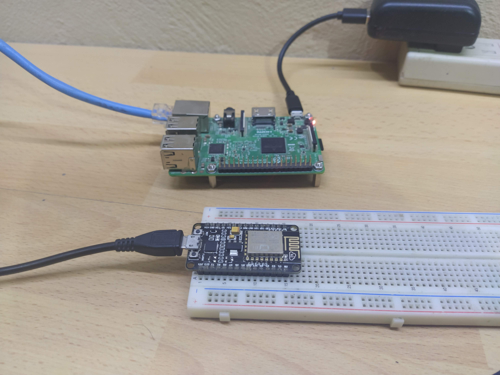

# Basic connection between arduino and raspberry pi through WiFi



## The Hardware is
  - Esp8266 with arduino sdk
  - Raspberry pi 3b+

## System requirements
  - arduino-cli
  - picocom
  - python3

## Configurations for Raspberry Pi
  - Install raspbian
  - Enable ssh server
  - Upgrade system
  - Configure keys for ssh server
  - [Configure the raspberry pi as hotspot](https://www.raspberrypi.org/documentation/configuration/wireless/access-point-routed.md)
  - Install python3 and set as default python interpreter 
  - Copy server code

## Configurations for ESP8266
  - Install esp8266 for arduino
  - Copy the code and upload to esp8266 board 

# Raspberry Pi Setup
Download raspbian buster lite from official repository
```sh
$ curl -LO http://downloads.raspberrypi.org/raspbian_lite/images/raspbian_lite-2020-02-14/2020-02-13-raspbian-buster-lite.zip
```

Write to sd card
```sh
$ unzip -p 2020-02-13-raspbian-buster-lite.zip | sudo dd of=/dev/mmcblk0 status=progress
```

Connect the raspberry pi via Ethernet and HDMI, startup the system and access with user=pi and password=raspberry\
Enable ssh service  
```sh
$ sudo systemctl enable --now ssh
```

Check what is the ip address and logout from the system
```sh
$ ip addr show eth0 # copy ip address
$ exit
```
Connect via ssh
```sh
$ ssh pi@{ip_address}
```

Add user with the same privileges and groups to pi user, generate password and delete the pi user
```sh
$ sudo useradd -m -s /bin/bash --groups $(groups pi | cut -d ' ' -f 4- --output-delimiter ',') new-user
```

Create password to new user
```sh
$ sudo passwd new-user 
```

Add new-user to sudoers file
```sh
$ echo "new-user ALL=(ALL) NOPASSWD: ALL" | sudo tee /etc/sudoers.d/010_new-user-nopasswd
```

Login to new user
```sh
$ su new-user
```

Check if sudo works
```sh
$ sudo apt update
```

Check groups
```sh
$ groups new-user
```

If everything works, logout and access to new-user with ssh, first logout
```sh
$ exit
```

Generate keys to new-user and copy to raspberry pi
```sh
$ ssh-keygen -f ~/.ssh/rpi-key
```

Copy public key to raspberry pi
```sh
$ ssh-copy-id -i ~/.ssh/rpi-key.pub new-user@{raspberry-pi-ip}
```

Now access to new-user on raspberry pi
```sh
$ ssh new-user@{raspberry-pi-ip}
```

Remove pi user
```sh
$ sudo userdel -rf pi
```

Update and upgrade the system
```sh
$ sudo apt update && sudo apt upgrade -y
```

Reboot the system
```sh
$ sudo reboot
```

## Setup hotspot
```
Create an access point in raspberry pi

 Diagram                                  +- RPi ---------+
                                      +---+ 192.168.10.15 |          +- ESP8266 ---+
                                      |   |     WLAN AP   +-)))  (((-+ WLAN Client |
                                      |   | 192.168.7.1   |          | 192.168.7.x |
                                      |   +---------------+          +-------------+
                                      .
                                      .
           		              .
                 +- Router -----+     |
                 | Firewall     |     |   +- PC#2 --------+
(Internet)---WAN-+ DHCP server  +-LAN-+---+ 192.168.10.11 |
                 | 192.168.10.1 |     |   +---------------+
                 +--------------+     |
                                      |   +- PC#1 --------+
                                      +---+ 192.168.10.10 |
                                          +---------------+

```

Install required packages
```sh
$ sudo apt-get -y install hostapd dnsmasq netfilter-persistent iptables-persistent
```

Enable wireless access point
```sh
$ sudo systemctl unmask hostapd
$ sudo systemctl enable hostapd
```

Define the wireless interface IP configuration \
Configure wlan0 interface in /etc/dhcpcd.conf
```sh
$ sudo vi /etc/dhcpcd.conf
```

Add the following lines
```
  interface wlan0
    static ip_address=192.168.7.1/24
    nohook wpa_supplicant
```
Save and quit

Enable ip forwarding\
Edit /etc/sysctl.conf
```sh
$ sudo vi /etc/sysctl.conf
```

Uncomment the following line
```
 net.ipv4.ip_forward=1
```
Save and quit

Allow traffic between clients on this foreign wireless network
```sh
$ sudo iptables -t nat -A POSTROUTING -o eth0 -j MASQUERADE
```

Make persistent changes
```sh
$ sudo netfilter-persistent save
```

Configure the DHCP and DNS services for the wireless network\
First create a backup 
```sh
$ sudo mv /etc/dnsmasq.conf /etc/dnsmasq.conf.orig
```

Edit /etc/dnsmasq.conf
```sh
$ sudo vi /etc/dnsmasq.conf
```

Add the following lines
```
  interface=wlan0 
  dhcp-range=192.168.7.2,192.168.7.40,255.255.255.0,24h
  domain=wlan
  address=/gw.wlan/192.168.7.1
```
Save and exit

Set WiFi country\
Localization Options -> Change WLAN Country -> choose your country -> finish
```sh
$ sudo raspi-config
```

Ensure wireless operation
```sh
$ sudo rfkill unblock wlan
```

Configure access point
```sh
$ sudo vi /etc/hostapd/hostapd.conf
```

Add the following lines
```
  country_code=MX
  interface=wlan0
  ssid=rpi-hotspot
  hw_mode=g
  channel=8
  macaddr_acl=0
  auth_algs=1
  ignore_broadcast_ssid=0
  wpa=2
  wpa_passphrase=rasp-p@s2w0rd
  wpa_key_mgmt=WPA-PSK
  wpa_pairwise=TKIP
  rsn_pairwise=CCMP
```
Save and exit

Reboot the system and check connection with new access point

Install python3 and set as default interpreter
```sh
$ sudo apt install -y python3
$ sudo rm /usr/bin/python
$ sudo ln -s /usr/bin/python3 /usr/bin/python
```

Copy pythonServer to raspberry pi

# ESP8266 Configurations 

Install required packages
  - arduino-cli
  - picocom

Install esp8266 arduino core\
First add additional boards in arduino-cli.yml
```sh
$ vim ~/Arduino/arduino-cli.yml
```

Add the following lines
```
# arduino-cli.yaml
board_manager:
  additional_urls:
    - http://arduino.esp8266.com/stable/package_esp8266com_index.json
```

Update index
```sh
$ arduino-cli --config-file ~/Arduino/arduino-cli.yml core update-index
```

Search esp8266 boards 
```sh
$ arduino-cli --config-file ~/Arduino/arduino-cli.yml core search esp8266
```
Install esp8266 boards
```sh
$ arduino-cli --config-file ~/Arduino/arduino-cli.yml core install esp8266:esp8266
```

Compile and upload the sketch, assuming that port of esp8266 is `/dev/ttyUSB0`
```sh
$ arduino-cli compile -b esp8266:esp8266:nodemcuv2 -u -p /dev/ttyUSB0 ~/WorkSpace/tutorials/rpi_WiFi-Hotspot/arduinoClient
```

# Test communications


Init server in raspberry pi
```sh
$ python ~/pythonServer/server.py
```

Init serial monitor for esp8266
```sh
$ picocom -b 115200 /dev/ttyUSB0
```
## Raspberry pi output
```
  Intialize socket server, listen port: 35000
  Connection from: ('192.168.7.17', 59552)
  From connected user: Init connection from ESP8266
  Write response -> hi from server
  From connected user: hi from client
  Write response -> send quit sequence
  Recive disconnect from client
  Close connection...
```

## Arduino output
```
  Wait for WiFi... .....
  WiFi connected
  IP address:
  192.168.7.17
  Connecting to 192.168.7.1:35000
  Wait response from server ...
  Server response: hi from server
  You response -> hi from client
  Server response: send quit sequence
  You response -> quit!
```

